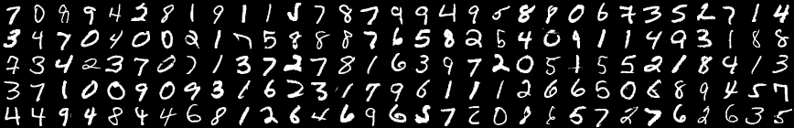

# HW1-HandWrittingRecognition
> This is the first homework of Neural Network course of FDU. 
> In this project, I will contrust a two layer fully connected neural network only by Numpy.

## Table of Contents
* [Setup](#Setup)
* [Dataset](#Dataset)
* [Usage](#usage)
* [Room for Improvement](#room-for-improvement)
* [Acknowledgements](#acknowledgements)
* [Contact](#contact)
<!-- * [License](#license) -->

## Setup
- python3
- numpy

```bash
pip install -r requirements
```


## Dataset: [mnist](http://yann.lecun.com/exdb/mnist/)

The MNIST database of handwritten digits has a training set of 60,000 examples, and a test set of 10,000 examples. 
The digits have been size-normalized and centered in a fixed-size image (28*28).
```bash
python mnist.py
```

## Usage
You can change the yaml file in cfgs to change the configuration.
See [fc2.yaml](./cfgs/fc2.yaml) for more detail.

train the model
```bash
python main.py --mode train --cfg_file ./cfgs/fc.yaml
```

test the model
```bash
python main.py --mode test --cfg_file ./cfgs/fc.yaml
```

## result
0.97 on test set.

## Room for Improvement
Include areas you believe need improvement / could be improved. Also add TODOs for future development.

Room for improvement:
- CNN
- more optimization algorithm
- more loss function


## Acknowledgements
- This dataloader was modified from [this repository](https://github.com/SalesRyan/Neural-Network-MNIST-Dataset)
- Many thanks to [this tutorial](https://github.com/leeroee/NN-by-Numpy)


## Contact
Created by [@AaronMeng](bymeng21@m.fudan.edu.cn) - feel free to contact me!


<!-- Optional -->
<!-- ## License -->
<!-- This project is open source and available under the [... License](). -->

<!-- You don't have to include all sections - just the one's relevant to your project -->
